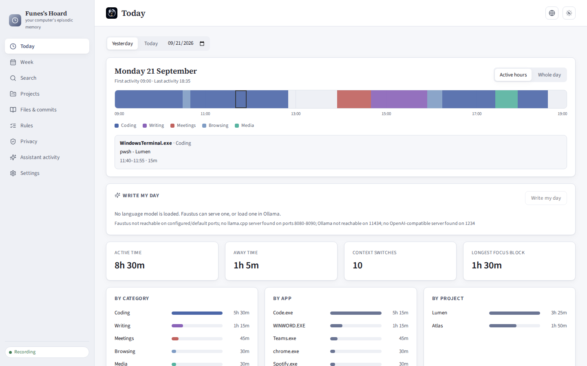

# Funes's Hoard
### ¿Dónde me había quedado? ¿Qué hacía antes de comer? ¿Cuánto de esta semana se fue de verdad en Faustus?
**La memoria episódica de tu ordenador: aplicación en primer plano, ventana, archivos abiertos y commits, guardados en un SQLite local y filtrados por privacidad antes de escribir nada.**

[English](README.md) · [Ejecutar en local](#ejecutar-en-local-en-windows) · [Conectar una IA](docs/MCP.md) · [Portfolio](https://luissalet.github.io/Portfolio/#projects)


*Aplicación real, tres días de datos de demostración sintéticos (`--demo`, sin títulos de ventana reales).*

## Por qué

Un asistente local no sabe qué había en la pantalla de su usuario. Si le
preguntas "¿dónde me había quedado?", "¿qué tal ha ido el día?" o "¿cuál
era esa página de DuckDB que tenía abierta ayer?", un modelo de lenguaje
solo puede inventarse la respuesta o pedirte que la reconstruyas tú.
Funes's Hoard guarda justo lo que el modelo no puede ver: la secuencia de
ventanas que tenías delante, con el tiempo inactivo y bloqueado, los
archivos que abriste y los commits que hiciste. Lo convierte en tramos,
resúmenes del día, bloques de concentración y respuestas para retomar el
contexto, y le da al asistente ocho herramientas pequeñas para consultarlo.

## Qué está implementado

| Área | Disponible ahora | Límite |
| --- | --- | --- |
| Captura | Aplicación en primer plano, título de ventana, inactividad y bloqueo, muestreados cada segundo en Windows (`ctypes` + `psutil`); agrupados en tramos activo/ausente/bloqueado; la ausencia empieza cuando dejaste de usar teclado y ratón, no cuando se detecta; las suspensiones y los momentos excluidos o en pausa cierran el tramo en lugar de estirarlo; el tramo abierto se guarda cada 30 s y, si la aplicación se cae, se cierra al volver a arrancar | La sonda de Linux (`xdotool`/`xprintidle`) es solo para desarrollo; las llamadas Win32 no se han ejecutado en este entorno (ver la nota de Windows) |
| Privacidad | Las reglas de exclusión descartan la muestra antes de guardarla (gestores de contraseñas, ventanas privadas o de incógnito, en inglés y español); las de ocultación guardan la aplicación y sustituyen el título; las reglas no válidas se rechazan en lugar de ignorarse en silencio; pausa de 15 min, 1 h o hasta reanudar, que se reanuda sola; purga por antigüedad; borrado de un rango (incluidos los tramos que lo solapan y sus entradas de búsqueda); exportación a JSON | Las reglas se aplican desde que se añaden, no a los títulos ya guardados |
| Clasificación | Reglas ordenadas por aplicación, expresión regular del título o dominio en el título, con valores por defecto para las aplicaciones habituales de Windows; detección del proyecto en títulos de VS Code (carpetas con guiones, remotas e Insiders), JetBrains y Visual Studio, y por los nombres de los repositorios git encontrados; vista previa ("reclasificaría N tramos"); reaplicación al historial en segundo plano, con progreso | No se lee la barra de direcciones del navegador; una regla de "dominio" busca el texto en el título |
| Conocimiento derivado | Totales por día, semana o rango, por categoría, aplicación y proyecto, recortados en los bordes del periodo; primera y última actividad; cambios de contexto (>= 10 s); bloques de concentración (>= 25 min, cada interrupción <= 2 min); "dónde estaba" con contextos distintos, su último título, archivos y commits | La concentración se mide por tiempo en ventana; no dice nada de la atención real |
| Otras fuentes | Archivos recientes mediante un lector de accesos directos (`.lnk`) escrito a partir de la especificación (rutas Unicode, sufijos de ruta, archivos truncados rechazados); commits de git en las carpetas configuradas, filtrados por los autores indicados o, por defecto, por la identidad git de cada repositorio | No se ven los archivos que no pasan por "Elementos recientes" de Windows |
| Búsqueda | SQLite FTS5 sobre títulos, rutas de archivo y asuntos de commits, sin distinguir tildes, por prefijo de palabra y a prueba de cualquier entrada; si no aparece nada con todas las palabras, prueba con cualquiera | Si el sqlite3 de la plataforma no trae FTS5, se usa una búsqueda `LIKE` (se comprueba al arrancar) |
| API del agente | Ocho herramientas, de solo lectura salvo una pausa que solo puede alargarse; horas ISO locales y textos legibles en cada resultado; límites pequeños con `has_more`/`next_offset`; todas las llamadas quedan registradas, también las rechazadas | Por diseño, el agente no puede reanudar, cambiar reglas, borrar ni exportar |
| Interfaz | Hoy (línea de tiempo con zoom, leyenda y detalle fijado), Semana (navegable), Buscar (filtro de fechas), Proyectos (selector de periodo), Archivos y commits, Reglas, Privacidad, Actividad del asistente; español e inglés; tema claro y oscuro | Pensada para escritorio, no para móvil |

Más pantallas: [Buscar](docs/media/search.png) · [Privacidad](docs/media/privacy.png) ·
[Actividad del asistente](docs/media/assistant-activity.png) (llamadas reales hechas
a través de la API del agente por `scripts/screenshots.py`, incluida una rechazada).

## Conectarlo a Faustus

La aplicación se declara con `faustus-plugin.json`. Arráncala y, en
Faustus, ve a **Connectors -> Nearby apps -> Add**.

| Herramienta | Qué hace | ¿Solo lectura? |
| --- | --- | --- |
| `activity_now` | Aplicación, título y proyecto actuales, segundos de inactividad, si graba o está en pausa (y hasta cuándo) | sí |
| `activity_where_was_i` | Retomar el contexto: los últimos contextos distintos antes de un momento, con título, archivos y commits | sí |
| `activity_timeline` | Tramos de un día o rango, paginados con `offset` | sí |
| `activity_summary` | Totales por categoría, aplicación o proyecto, bloques de concentración y cambios de contexto | sí |
| `activity_search` | Cuándo apareció un título, archivo o commit con ciertas palabras | sí |
| `activity_recent_files` | Archivos abiertos hace poco | sí |
| `activity_projects` | Tiempo por proyecto, última vez y commits | sí |
| `activity_pause` | Pausar la grabación; nunca acorta una pausa ya puesta | **no** (la única escritura) |

Funciona con cualquier cliente MCP por stdio; en [docs/MCP.md](docs/MCP.md)
están la salida de cada herramienta, los códigos de error y un ejemplo de
configuración. La skill [`skills/where-was-i/SKILL.md`](skills/where-was-i/SKILL.md)
le explica a un modelo local qué herramienta usar y en qué trampas no caer.

## Ejecutar en local en Windows

Haz doble clic en **`Iniciar Funes's Hoard.cmd`**. Ejecuta
`scripts\start.ps1`, que la primera vez crea `.venv` (Python 3.11 o
posterior, con preferencia por `C:\Python313`), instala
`requirements-lock.txt` y compila la interfaz si falta `frontend\dist`; las
siguientes veces solo reinstala si ha cambiado el lock. Después arranca la
aplicación oculta, con la raíz del repositorio como carpeta de trabajo,
espera a que responda `/api/health` y abre `http://127.0.0.1:8813`. Si ya
estaba en marcha, simplemente la abre. **`Detener Funes's Hoard.cmd`** la
para. `scripts\start.ps1 -Demo` la arranca con datos sintéticos.

Pasos manuales:

```powershell
python -m venv .venv
.venv\Scripts\pip install -r requirements-lock.txt
cd frontend; npm ci; npm run build; cd ..
.venv\Scripts\python -m funes_hoard
```

Opciones: `--demo` (datos sintéticos en `data-demo/`, no se graba nada del
escritorio), `--data-dir`, `--port`, `--no-browser`. Los datos se guardan
en `data/` (o en `FUNES_DATA_DIR`). La aplicación solo escucha en la
interfaz local; `--host` no acepta otra cosa.

## Arquitectura

FastAPI, un hilo que muestrea una vez por segundo, otro hilo para
archivos recientes, git y purga, y SQLite en modo WAL. La lógica de
tramos, privacidad, clasificación y resúmenes es Python puro, sin FastAPI
ni sqlite. Detalles en [docs/ARCHITECTURE.md](docs/ARCHITECTURE.md).

## Pruebas

```
.venv/bin/python -m pytest -q          # 179 pasan en unos 10 s
cd frontend && npm ci && npm run build  # 0 errores de TypeScript
```

Cubren la agrupación en tramos, el inicio de la ausencia y del bloqueo, las
suspensiones, los intervalos excluidos o en pausa, el guardado periódico y
los tramos que quedan abiertos tras una caída; las reglas de privacidad
(comprobando que la fila excluida no llega a existir) y su validación; la
expiración de la pausa y la pausa del agente, que solo alarga; la purga y
el borrado de rangos, incluido el índice de búsqueda; el lector de `.lnk`
con ficheros construidos en las propias pruebas (ANSI, Unicode, sufijo,
truncado); la detección de proyecto en títulos de editores; los bloques de
concentración, los cambios de contexto, el recorte por periodo y "dónde
estaba" con días simulados; las palabras de fecha en ambos idiomas y qué
extremo del periodo representan; la búsqueda con FTS5 y con `LIKE` ante
entradas hostiles; el filtro contra ataques desde el navegador (puertos de
Host y Origin, origen `null`), la corrección del acceso a archivos fuera de
la interfaz y la lista exacta de rutas del agente; la lógica de la sonda
de Windows con las llamadas Win32 simuladas (desbordamiento del contador,
ejecutables sin permiso); el escaneo de git con asuntos UTF-8, filtros de
autor y sin ventanas de consola; la línea de comandos; el manifiesto; y una
prueba de protocolo MCP que lanza `mcp_server.py` por stdio contra la
aplicación en marcha y comprueba las palabras clave, las anotaciones, los
errores y el registro de llamadas.

## Privacidad y límites

- Todo se queda en `data/funes.sqlite3`, en este ordenador. Sin telemetría
  y sin uso de red; `git log` se ejecuta en local.
- Las reglas de exclusión actúan antes de escribir la muestra; una prueba
  comprueba que la fila no llega a existir. Los títulos ocultados nunca
  entran en el índice de búsqueda.
- El asistente solo ve lo que devuelven las ocho herramientas y solo puede
  hacer una cosa: pausar (o alargar una pausa). Cada llamada aparece en
  "Actividad del asistente".
- Los resultados están acotados (de 5 a 40 elementos por defecto, 100 como
  máximo) y los títulos largos se recortan, porque quien los lee es un
  modelo local con un contexto limitado.

### Límites

- No hay lector de la barra de direcciones del navegador: el lector de UI
  Automation opcional del plan original se descartó antes que entregarlo
  frágil. Las reglas sobre el título cubren la mayoría de casos.
- La purga y el borrado de rangos también eliminan `file_events` y
  `commits` del mismo periodo, no solo los tramos: borrar el historial
  significa borrarlo entero.

### Riesgos de Windows que no se pueden comprobar desde este entorno Linux

Construido y probado en Linux con Python 3.11; el destino es Windows con
Python 3.13. Conviene revisarlo en la primera ejecución real:

1. **Las llamadas Win32** de `WindowsProbe` (`GetForegroundWindow`,
   `GetLastInputInfo`, `OpenInputDesktop`) no se han ejecutado aquí. Sus
   firmas están declaradas y la lógica que las rodea está probada con las
   llamadas simuladas, pero el bloqueo se detecta porque `OpenInputDesktop`
   falla en el escritorio seguro, así que un aviso de UAC también contará
   como "bloqueado".
2. **FTS5 en el sqlite3 de Python 3.13 de python.org**: si falta, la
   aplicación usa búsqueda `LIKE`.
3. **Los lanzadores de PowerShell** se han analizado y el arranque se ha
   ejecutado con PowerShell 7 en Linux (sin `-WindowStyle Hidden`, que solo
   existe en Windows); `stop.ps1` usa `Get-CimInstance` y
   `Get-NetTCPConnection`, que no se han ejecutado.
