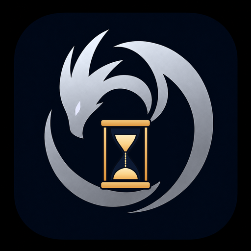
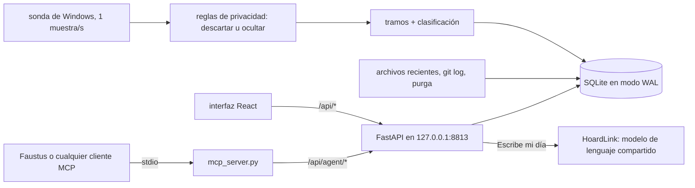

# Funes's Hoard

### ¿Dónde me había quedado? ¿Qué hacía antes de comer? ¿Cuánto de esta semana se fue de verdad en Faustus?

**La memoria episódica de tu ordenador: aplicación en primer plano, ventana, archivos abiertos y commits, guardados en un SQLite local y filtrados por privacidad antes de escribir nada.**

[English](README.md) · [Inicio rápido](#inicio-rápido) · [Conectar con Faustus](#conectarlo-a-faustus) · [Referencia MCP](docs/MCP.md) · [Portfolio](https://luissalet.github.io/Portfolio/#projects)


*Aplicación real, tres días de datos de demostración sintéticos (`--demo`, sin títulos de ventana reales).*

> **Antes que nada, qué hace esta aplicación con tu actividad.**
>
> - **Dónde se guarda:** en un único archivo SQLite, `data/funes.sqlite3`,
>   en este ordenador. Sin cuentas, sin telemetría y sin copia en la nube.
> - **Qué graba:** la aplicación en primer plano, el título de su ventana,
>   el tiempo inactivo y bloqueado, los archivos abiertos que pasan por
>   "Elementos recientes" de Windows y los commits de las carpetas git que
>   añadas.
> - **Qué no graba nunca:** pulsaciones de teclado, el contenido de la
>   pantalla, capturas ni el portapapeles. Los gestores de contraseñas y las
>   ventanas privadas o de incógnito se excluyen por defecto, y tus propias
>   reglas pueden descartar u ocultar cualquier aplicación o ventana *antes*
>   de que se guarde la muestra.
> - **Pausa:** 15 min, 1 h o hasta que la reanudes, desde cualquier
>   pantalla. El asistente también puede pausar, pero nunca reanudar ni
>   acortar tu pausa.
> - **Borrado:** cualquier rango de tiempo, de forma permanente, desde
>   **Privacidad** (con atajos de "últimos 15 min / 30 min / última hora /
>   hoy"), además de una purga automática a los 180 días por defecto.
> - **Qué sale de la aplicación:** solo "Escribe mi día", si lo usas, envía
>   un resumen compacto del día (categorías, aplicaciones, proyectos,
>   duraciones; nunca títulos de ventana) al modelo de lenguaje que Hoard
>   Link encuentre en este equipo o a la dirección que pongas en Ajustes. Se
>   puede desactivar.
>
> El detalle completo está en [Privacidad y seguridad](#privacidad-y-seguridad).

## Por qué

Un asistente local no sabe qué había en la pantalla de su usuario. Si le
preguntas "¿dónde me había quedado?", "¿qué tal ha ido el día?" o "¿cuál
era esa página de DuckDB que tenía abierta ayer?", un modelo de lenguaje
solo puede inventarse la respuesta o pedirte que la reconstruyas tú.
Funes's Hoard guarda justo lo que el modelo no puede ver: la secuencia de
ventanas que tenías delante, con el tiempo inactivo y bloqueado, los
archivos que abriste y los commits que hiciste. Lo convierte en tramos,
resúmenes del día, bloques de concentración y respuestas para retomar el
contexto, y le da al asistente ocho herramientas pequeñas para consultarlo.

## Qué está implementado

| Área | Disponible ahora | Límite |
| --- | --- | --- |
| Captura | Aplicación en primer plano, título de ventana, inactividad y bloqueo, muestreados cada segundo en Windows (`ctypes` + `psutil`); agrupados en tramos activo/ausente/bloqueado; la ausencia empieza cuando dejaste de usar teclado y ratón, no cuando se detecta, salvo en una reunión o un vídeo (también en una pestaña del navegador), que tienen un umbral aparte y más largo (60 min por defecto) antes de que solo lo que pase de él cuente como ausencia; las suspensiones y los momentos excluidos o en pausa cierran el tramo en lugar de estirarlo; el tramo abierto se guarda cada 30 s y, si la aplicación se cae, se cierra al volver a arrancar | La sonda de Linux (`xdotool`/`xprintidle`) es solo para desarrollo; las llamadas Win32 se prueban con simulaciones (ver [límites conocidos](#hoja-de-ruta-y-límites-conocidos)) |
| Privacidad | Las reglas de exclusión descartan la muestra antes de guardarla (gestores de contraseñas, ventanas privadas o de incógnito, en inglés y español); las de ocultación guardan la aplicación y sustituyen el título; las reglas no válidas se rechazan en lugar de ignorarse en silencio; pausa de 15 min, 1 h o hasta reanudar, que se reanuda sola; purga por antigüedad; borrado de un rango (incluidos los tramos que lo solapan y sus entradas de búsqueda), con atajos de últimos 15 min / 30 min / última hora / hoy; exportación de los tramos a CSV o de todo a JSON, opcionalmente para un rango de días | Las reglas se aplican desde que se añaden, no a los títulos ya guardados |
| Clasificación | Reglas ordenadas por aplicación, expresión regular del título o dominio en el título, con valores por defecto para las aplicaciones habituales de Windows; detección del proyecto en títulos de VS Code (carpetas con guiones, remotas e Insiders), JetBrains y Visual Studio, y por los nombres de los repositorios git encontrados; vista previa ("reclasificaría N tramos"); reaplicación al historial en segundo plano, con progreso | No se lee la barra de direcciones del navegador; una regla de "dominio" busca el texto en el título |
| Conocimiento derivado | Totales por día, semana o rango, por categoría, aplicación y proyecto, recortados en los bordes del periodo; primera y última actividad; cambios de contexto (>= 10 s); bloques de concentración (>= 25 min, cada interrupción <= 2 min); "dónde estaba" con contextos distintos (primero el trabajo; sin música, chats ni juegos salvo que se pida), sus últimos títulos, archivos (primero los del propio proyecto) y commits | La concentración se mide por tiempo en ventana; no dice nada de la atención real |
| Otras fuentes | Archivos recientes mediante un lector de accesos directos (`.lnk`) escrito a partir de la especificación (rutas Unicode, sufijos de ruta, archivos truncados rechazados); commits de git en las carpetas configuradas, filtrados por los autores indicados o, por defecto, por la identidad git de cada repositorio | No se ven los archivos que no pasan por "Elementos recientes" de Windows |
| Búsqueda | SQLite FTS5 sobre títulos, rutas de archivo y asuntos de commits, sin distinguir tildes, por prefijo de palabra y a prueba de cualquier entrada; si no aparece nada con todas las palabras, prueba con cualquiera; un resultado de ventana dice cuánto tiempo estuvo abierta y, en la interfaz, abre su día en ese momento | Si el sqlite3 de la plataforma no trae FTS5, se usa una búsqueda `LIKE` (se comprueba al arrancar) |
| API del agente | Once herramientas, de solo lectura salvo una pausa que solo puede alargarse; horas ISO locales y textos legibles en cada resultado; límites pequeños con `has_more`/`next_offset`; los ids y las horas se encadenan de una llamada a la siguiente (`activity_timeline(around=<ts de un resultado>)`); todas las llamadas quedan registradas, también las rechazadas | Por diseño, el agente no puede reanudar, cambiar reglas, borrar ni exportar |
| Recall | `recall`/`recall_search` combinan los propios episodios de Funes con las demás apps Hoard locales -- Argus (pantalla), Echo (portapapeles), Scribe (audio) -- en una única línea de tiempo ordenada y citable (`[argus:moment 88 16:02]`); una fuente que no está en marcha aparece como `unavailable`, nunca rompe la llamada ([docs/RECALL.md](docs/RECALL.md)) | Necesita las apps hermanas en marcha y accesibles por loopback; Funes solo llama a su API de agente de solo lectura, nunca a sus archivos directamente |
| Modelos compartidos | "Escribe mi día": una narración breve del día en segunda persona ("You spent the morning on..."; el modelo recibe las instrucciones en inglés y suele responder en inglés), guardada y regenerable, a partir de los mismos datos compactos que devuelve `activity_summary` (nunca títulos reales u ocultados); en Ajustes se ve el modelo resuelto, el proveedor y, si no hay ninguno, el motivo en una frase, con un botón para volver a comprobar y ajustes manuales | Solo en la interfaz, no es una herramienta MCP; necesita un modelo de lenguaje accesible por Hoard Link (Faustus, o un servidor Ollama, llama.cpp u otro compatible con OpenAI que ya esté en marcha); un día sin nada registrado se rechaza sin llamar al modelo |
| Interfaz | Hoy (línea de tiempo con zoom en la que se ven la ausencia y el bloqueo, leyenda, detalle fijado, tramos accesibles con el teclado, "¿Dónde lo dejé?" y "Escribe mi día"), Semana (navegable), Buscar (filtro de fechas), Proyectos (selector de periodo), Archivos y commits, Reglas, Privacidad, Ajustes (Modelos), Actividad del asistente; cada día y cada momento tienen su propia dirección (recargar y Atrás funcionan); español e inglés; tema claro y oscuro | Pensada para escritorio, no para móvil |

Más pantallas: [Buscar](docs/media/search.png) · [Privacidad](docs/media/privacy.png) ·
[Ajustes](docs/media/settings.png) ·
[Actividad del asistente](docs/media/assistant-activity.png) (llamadas reales hechas
a través de la API del agente por `scripts/screenshots.py`, incluida una rechazada).

## Casos de uso

Ocho escenarios concretos de un desarrollador ficticio, recorridos de
principio a fin como persona en el navegador y como modelo local por MCP
([docs/USE_CASES.md](docs/USE_CASES.md); hallazgos y arreglos en
[docs/USABILITY_REPORT.md](docs/USABILITY_REPORT.md)):

- **Lunes por la mañana, "¿dónde lo dejé?"**: la pantalla Hoy abre con los
  tres últimos contextos de trabajo (proyecto, últimos títulos, archivos,
  commits), así que el último archivo del viernes se ve antes de elegir un
  día; un clic fija ese momento en la línea de tiempo de su día.
- **"Faustus, ¿qué estaba haciendo a las 16:00?"**: una sola llamada a
  `recall` combina el historial de ventanas de Funes con lo que había en
  pantalla (Argus), lo que se copió (Echo) y lo que se dijo en una llamada
  (Scribe) alrededor de ese momento, cada resultado con una cita breve para
  responder citándola; si una fuente no está en marcha, aparece como no
  disponible y el resto de la respuesta llega igual.
- **"Faustus, ¿dónde lo dejé ayer?"**: una sola llamada a
  `activity_where_was_i`, unos 500 tokens, responde con el proyecto, la
  ventana y el título del editor que nombra el archivo, sin contar la música
  ni el chat.
- **Una nota semanal para una búsqueda de empleo**: `activity_summary` da
  las horas por proyecto como textos listos para leer, y una búsqueda de
  los portales de empleo o del título de una novela dice cuánto tiempo
  estuvieron abiertas esas ventanas; Faustus escribe la nota con su propia
  herramienta de notas.
- **"Esa página de FTS5 del martes"**: buscas, haces clic en el resultado y
  llegas a ese día con el tramo fijado (la dirección lo conserva, así que
  recargar y Atrás funcionan); un agente pasa el `ts` del resultado a
  `activity_timeline(around=...)`.
- **Privacidad antes de una entrevista o del banco**: pausa de una hora,
  las ventanas privadas (también "incógnito" en español) y las páginas del
  banco nunca se pueden buscar, y "Últimos 30 min" rellena el borrado de un
  rango para la media hora que se te olvidó.
- **Horas por proyecto para un gráfico**: exporta los tramos a CSV (fechas y
  horas locales, minutos, categoría, proyecto) para una hoja de cálculo o
  una herramienta de análisis de datos.

## Inicio rápido

```powershell
git clone https://github.com/Luissalet/FunesHoard.git
cd FunesHoard
```

### Windows

Haz doble clic en **`Iniciar Funes's Hoard.cmd`**. Ejecuta
`scripts\start.ps1`, que la primera vez crea `.venv` (Python 3.11 o
posterior, con preferencia por `C:\Python313`), instala
`requirements-lock.txt` y compila la interfaz si falta `frontend\dist`
(Node 22); las siguientes veces solo reinstala si ha cambiado el lock.
Después arranca la aplicación oculta, con la raíz del repositorio como
carpeta de trabajo, espera a que responda `/api/health` y abre
`http://127.0.0.1:8813`. Si ya estaba en marcha, simplemente la abre.
**`Detener Funes's Hoard.cmd`** la para. Lo mismo desde PowerShell:
`scripts\start.ps1 [-Port 8813] [-Demo] [-NoBrowser]` y
`scripts\stop.ps1`.

Pasos manuales:

```powershell
python -m venv .venv
.venv\Scripts\pip install -r requirements-lock.txt
cd frontend; npm ci; npm run build; cd ..
.venv\Scripts\python -m funes_hoard
```

### Linux / macOS

La grabación está pensada para Windows: en Linux la sonda es aproximada
(X11 con `xdotool` y `xprintidle`) y en macOS no hay sonda. La interfaz, la
API y las herramientas MCP funcionan con datos sintéticos usando `--demo`.
Hace falta Python 3.11 o posterior y Node 22:

```bash
python3 -m venv .venv
.venv/bin/pip install -r requirements-lock.txt
(cd frontend && npm ci && npm run build)
.venv/bin/python -m funes_hoard --demo
```

La aplicación responde en `http://127.0.0.1:8813`
(`curl http://127.0.0.1:8813/api/health`).

Opciones: `--demo` (datos sintéticos en `data-demo/`, no se graba nada del
escritorio), `--data-dir` (o `FUNES_DATA_DIR`), `--port`, `--no-browser`.
Tus datos se guardan en `data/`. La aplicación solo escucha en la interfaz
local; `--host` no acepta otra cosa.

## Conectarlo a Faustus

Funes's Hoard es un plugin de [Faustus](https://github.com/Luissalet/Faustus)
y se declara con [`faustus-plugin.json`](faustus-plugin.json) en la raíz del
repositorio. Arranca la aplicación y, en Faustus, abre **Connectors ->
Nearby apps -> Add**: Faustus la encuentra en el puerto 8813, comprueba que
`/api/health` responde como `funes-hoard`, arranca el adaptador MCP y carga
la skill [`where-was-i`](skills/where-was-i/SKILL.md), que le explica a un
modelo local qué herramienta usar y en qué trampas no caer. El adaptador es
un script stdio que se lanza por su ruta, con la URL de la aplicación en
`FUNES_URL`:

```powershell
$env:FUNES_URL = "http://127.0.0.1:8813"
.venv\Scripts\python.exe funes_hoard\mcp_server.py
```

### Herramientas MCP

| Herramienta | Qué hace | ¿Solo lectura? |
| --- | --- | --- |
| `activity_now` | Aplicación, título y proyecto actuales, segundos de inactividad, si graba o está en pausa (y hasta cuándo) | sí |
| `activity_where_was_i` | Retomar el contexto: los últimos contextos distintos antes de un momento, con título, archivos y commits | sí |
| `activity_timeline` | Tramos de un día o rango, paginados con `offset` | sí |
| `activity_summary` | Totales por categoría, aplicación o proyecto, bloques de concentración y cambios de contexto | sí |
| `activity_search` | Cuándo apareció un título, archivo o commit con ciertas palabras | sí |
| `activity_recent_files` | Archivos abiertos hace poco | sí |
| `activity_projects` | Tiempo por proyecto, última vez y commits | sí |
| `activity_pause` | Pausar la grabación; nunca acorta una pausa ya puesta | **no** (la única escritura) |
| `recall` | "Qué estaba haciendo a las X" combinado entre Funes, Argus, Echo y Scribe, con una cita breve por resultado | sí |
| `recall_search` | La misma combinación, pero busca texto en un rango en vez de un momento | sí |
| `sources_status` | Estado de cada fuente combinada (en marcha, accesible, token aceptado) | sí |

Funciona con cualquier cliente MCP por stdio; en [docs/MCP.md](docs/MCP.md)
están la salida de cada herramienta, los códigos de error y un ejemplo de
configuración, y en [docs/RECALL.md](docs/RECALL.md) se explican las
herramientas `recall` combinadas y el formato de cita al completo.

## Modelos compartidos (HoardLink)

La única función que necesita un modelo de lenguaje, "Escribe mi día",
nunca carga uno propio: usa [HoardLink](https://github.com/Luissalet/HoardLink)
(incluido en [`funes_hoard/hoard_link/`](funes_hoard/hoard_link/)), el
mismo resolutor que comparten todas las aplicaciones del ecosistema
Faustus, en este orden -- el ajuste manual de Ajustes, después el
registro de modelos de la propia Faustus y, por último, un servidor
llama.cpp, Ollama u otro compatible con OpenAI que ya esté en marcha en
este equipo. El resto de la aplicación funciona por completo sin ningún
modelo, y Ajustes explica exactamente por qué cuando no hay ninguno
disponible.

## Arquitectura



FastAPI, un hilo que muestrea una vez por segundo, otro hilo para
archivos recientes, git y purga, y SQLite en modo WAL. La lógica de
tramos, privacidad, clasificación y resúmenes es Python puro, sin FastAPI
ni sqlite. El adaptador MCP es un script aparte que solo habla HTTP con la
aplicación. Detalles en [docs/ARCHITECTURE.md](docs/ARCHITECTURE.md).

## Privacidad y seguridad

- Todo se queda en `data/funes.sqlite3`, en este ordenador. Sin telemetría
  y sin uso de red; `git log` se ejecuta en local. La única excepción es
  "Escribe mi día", descrito más arriba: solo envía al modelo de lenguaje
  los datos compactos de `activity_summary` (categorías, aplicaciones,
  proyectos, duraciones, bloques de concentración) -- nunca títulos de
  ventana reales u ocultados -- y se puede desactivar en Ajustes; borrar el
  historial de un día también borra su narración guardada.
- Las reglas de exclusión actúan antes de escribir la muestra; una prueba
  comprueba que la fila no llega a existir. Los títulos ocultados nunca
  entran en el índice de búsqueda.
- El servidor solo escucha en la interfaz local. Un middleware rechaza el
  DNS rebinding (una cabecera `Host` que no sea un nombre local con el
  puerto de esta aplicación) y las escrituras desde otros sitios (un
  `Origin` ajeno o `Sec-Fetch-Site: cross-site`); no hay CORS.
- El asistente solo ve lo que devuelven las ocho herramientas y solo puede
  hacer una cosa: pausar (o alargar una pausa). Cada llamada, también las
  rechazadas, se guarda en la tabla de auditoría `agent_calls`
  (herramienta, resumen de argumentos, duración, correcta o con error) y
  aparece en "Actividad del asistente".
- Los resultados están acotados (de 5 a 20 elementos por defecto, 100 como
  máximo) y los títulos largos se recortan, porque quien los lee es un
  modelo local con un contexto limitado; las instrucciones del servidor le
  piden al modelo que trate los títulos de ventana como datos, nunca como
  instrucciones.
- La purga y el borrado de rangos también eliminan `file_events` y
  `commits` del mismo periodo, no solo los tramos: borrar el historial
  significa borrarlo entero.

## Desarrollo

```bash
.venv/bin/python -m pytest tests/ -q    # 300+ pasan, sin red, en 15-30 s
cd frontend && npm ci && npm run build  # 0 errores de TypeScript
```

En Windows, `.venv\Scripts\python -m pytest tests/ -q`. La integración
continua ejecuta esas mismas dos tareas en Ubuntu con Python 3.12 y
Node 22.

Las pruebas cubren la agrupación en tramos, el inicio de la ausencia y del
bloqueo, las suspensiones, los intervalos excluidos o en pausa, el guardado
periódico y los tramos que quedan abiertos tras una caída; las reglas de
privacidad (comprobando que la fila excluida no llega a existir) y su
validación; la expiración de la pausa y la pausa del agente, que solo
alarga; la purga y el borrado de rangos, incluido el índice de búsqueda y
el resumen guardado de "Escribe mi día"; el lector de `.lnk` con ficheros
construidos en las propias pruebas (ANSI, Unicode, sufijo, truncado); la
detección de proyecto en títulos de editores; los bloques de
concentración, los cambios de contexto, el recorte por periodo y "dónde
estaba" con días simulados; las palabras de fecha en ambos idiomas y qué
extremo del periodo representan; la búsqueda con FTS5 y con `LIKE` ante
entradas hostiles; el filtro contra ataques desde el navegador (puertos de
Host y Origin, origen `null`), la corrección del acceso a archivos fuera de
la interfaz y la lista exacta de rutas del agente; el modelo compartido (la
persistencia y combinación de `backend.json`, que el token nunca se
devuelve, los estados resuelto/no disponible en Ajustes, el intercambio al
volver a comprobar, y "Escribe mi día" -- guardado, regeneración,
desactivación y el rechazo de días vacíos y respuestas vacías -- contra un
`Link` simulado, más una pasada por el resolutor real con un transporte
HTTP simulado, nunca una llamada de red real); la lógica de la sonda de
Windows con las llamadas Win32 simuladas (desbordamiento del contador,
ejecutables sin permiso); el escaneo de git con asuntos UTF-8, filtros de
autor, sin ventanas de consola y en zonas horarias por delante de UTC; la
línea de comandos; el manifiesto; y una prueba de protocolo MCP que lanza
`mcp_server.py` por stdio contra la aplicación en marcha y comprueba las
palabras clave, las anotaciones, los errores y el registro de llamadas.

`scripts/uxtest_data.py`, `scripts/ui_walkthrough.py` y
`scripts/agent_walkthrough.py` regeneran el conjunto de datos realista y
repiten los casos de uso en el navegador y por MCP;
`scripts/screenshots.py` vuelve a hacer las imágenes de `docs/media/`.

## Hoja de ruta y límites conocidos

- **Lo específico de Windows se prueba con simulaciones.** Las pruebas y la
  integración continua se ejecutan en Linux; el destino es Windows con
  Python 3.13. Las llamadas Win32 de `WindowsProbe` (`GetForegroundWindow`,
  `GetLastInputInfo`, `OpenInputDesktop`) tienen sus firmas declaradas y la
  lógica que las rodea se prueba con las llamadas simuladas. El bloqueo se
  detecta porque `OpenInputDesktop` falla en el escritorio seguro, así que
  un aviso de UAC también cuenta como "bloqueado".
- **FTS5 en el sqlite3 de Python 3.13 de python.org** debería estar, pero se
  comprueba al arrancar; si falta, la búsqueda usa `LIKE`.
- **Los lanzadores de PowerShell** se han ejecutado con PowerShell 7 en
  Linux (sin `-WindowStyle Hidden`, que solo existe en Windows); las
  llamadas a `Get-CimInstance` y `Get-NetTCPConnection` de `stop.ps1` no se
  han probado.
- **No hay lector de la barra de direcciones del navegador:** una regla
  sobre el título decide si algo es streaming o navegación, así que un
  vídeo en un sitio que la regla no conoce sigue siendo navegación, con el
  umbral de inactividad normal.
- "¿Dónde lo dejé?" mira tres días atrás; tras una ausencia más larga dice
  que no hay nada que retomar.
- El panel de Modelos muestra el motivo técnico del backend en inglés en
  los dos idiomas, y "Escribe mi día" suele responder en inglés.

En [docs/USABILITY_REPORT.md](docs/USABILITY_REPORT.md) está cómo se
encontró cada punto.

## Licencia

MIT; consulta [LICENSE](LICENSE).
