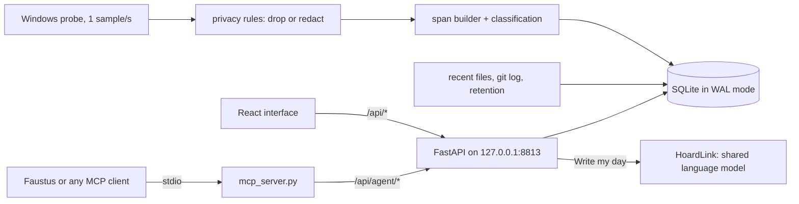

# Funes's Hoard

### Where was I? What was I doing before lunch? How much of this week actually went to Faustus?

**Your computer's episodic memory: foreground app, window, files opened and commits made, kept in a local SQLite file and filtered for privacy before anything is written.**

[Español](README.es.md) · [Quick start](#quick-start) · [Connect to Faustus](#connect-it-to-faustus) · [MCP reference](docs/MCP.md) · [Portfolio](https://luissalet.github.io/Portfolio/#projects)


*Actual application, three days of synthetic demo data (`--demo`, no real window titles).*

> **Before anything else, what this does with your activity.**
>
> - **Where it lives:** one SQLite file, `data/funes.sqlite3`, on this
>   computer. No account, no telemetry, no cloud copy.
> - **What is recorded:** the foreground app, its window title, idle and
>   locked time, files opened through Windows Recent Items, and commits in
>   the git folders you add.
> - **What is never recorded:** keystrokes, screen content, screenshots or
>   the clipboard. Password managers and private/incognito windows are
>   excluded by default, and your own rules can drop or redact any app or
>   window *before* a sample is written.
> - **Pause:** 15 min, 1 h or until you resume, from any screen. The
>   assistant can pause too, but can never resume or shorten your pause.
> - **Delete:** any time range, permanently, from **Privacy** (with
>   "last 15 min / 30 min / hour / today" shortcuts), plus automatic purge
>   after 180 days by default.
> - **What leaves the app:** only "Write my day", if you use it, sends a
>   compact day summary (categories, apps, projects, durations; never
>   window titles) to the language model Hoard Link finds on this machine
>   or the address you set in Settings. It can be switched off.
>
> Full detail in [Privacy and security](#privacy-and-security).

## Why

A local assistant has no record of what was on the user's screen. Asked
"where was I?", "how did today go?" or "what was that DuckDB page I had
open yesterday?", a language model can only invent an answer or ask the
user to reconstruct it. Funes's Hoard records the one thing the model
cannot see: the sequence of windows in front of the user, with idle and
locked time, the files they opened and the commits they made. It turns
that into spans, day summaries, focus blocks and resume-context answers,
and gives the assistant eight small tools to ask for them.

## What is implemented

| Area | Available now | Boundary |
| --- | --- | --- |
| Collection | Foreground app, window title, idle and locked state sampled every second on Windows (`ctypes` + `psutil`); merged into active/away/locked spans; away time back-dated to when input stopped, except in a meeting or a video (also one in a browser tab), which get a separate, longer threshold (60 min by default) before only the rest counts as away; sleep gaps and excluded or paused moments close the span instead of bridging it; the open span is flushed every 30 s and a crashed session's span is closed on the next start | The Linux probe (`xdotool`/`xprintidle`) is a development aid; the Win32 calls are tested with the calls faked (see [known limits](#roadmap--known-limits)) |
| Privacy | Exclusion rules drop a sample before it is stored (password managers, private/incognito windows, EN+ES); redaction rules keep the app and replace the title; invalid rules are rejected, not silently ignored; pause 15 min / 1 h / until resumed, with automatic resume; retention purge; delete a range (overlapping spans and their search rows included), with last 15 min / 30 min / hour / today shortcuts; export spans as CSV or everything as JSON, optionally for a range of days | Rules apply from the moment they are added, not retroactively to stored titles |
| Classification | Ordered app / title-regex / domain-in-title rules with defaults for common Windows apps; project detection from VS Code (hyphenated folders, remote and Insiders titles), JetBrains and Visual Studio titles, plus the names of discovered git repos; live preview ("would reclassify N spans"); reapply to history as a background job with progress | Browser domains are not read from the address bar; a "domain" rule matches text in the title |
| Derived knowledge | Day, week and range totals by category/app/project, clipped at the window edges; first/last activity; context switches (>= 10 s dwell); focus blocks (>= 25 min, each interruption <= 2 min); "where was I" with distinct contexts (work first; music, chat and games left out unless asked), their recent titles, files (the project's own first) and commits | Focus is measured from window time only; it says nothing about attention |
| Other sources | Recent files from a Shell Link (`.lnk`) parser written from the spec (Unicode paths, path suffixes, truncated files rejected); git commits from configured roots, filtered by configured authors or, by default, each repo's own git identity | Files opened without passing through Windows Recent Items are not seen |
| Search | SQLite FTS5 over titles, file paths and commit subjects, accent-insensitive, prefix words, safe for any input; falls back to "any word" when all words find nothing; a window hit says how long it was open and, in the interface, opens its day at that moment | If the platform's sqlite3 lacks FTS5 the app uses `LIKE` search (checked at startup) |
| Agent API | Eight tools, read-only except a pause that can only extend; local ISO times and human strings in every result; small limits with `has_more`/`next_offset`; ids and times chain from one call into the next (`activity_timeline(around=<a hit's ts>)`); every call audited, including rejected ones | The agent cannot resume, change rules, delete or export, by design |
| Shared models | "Write my day": a cached, regenerable short narrative of a day ("You spent the morning on..."), from the same compact data `activity_summary` returns (never raw or redacted titles); Settings shows the resolved model, provider and a plain-English reason when none is available, with a Re-check button and manual overrides | UI-only, not an MCP tool; needs a language model reachable through Hoard Link (Faustus, or a shared Ollama, llama.cpp or other OpenAI-compatible server); a day with nothing recorded is refused without calling the model |
| Interface | Today (zoomable timeline with away and locked time drawn, legend, pinned details, keyboard-focusable segments, Where was I?, Write my day), Week (navigable), Search (date filter), Projects (range picker), Files & commits, Rules, Privacy, Settings (Models), Assistant activity; every day and moment has its own address (reload and Back work); English/Spanish; light/dark | Desktop layout; not designed for phones |

More screens: [Search](docs/media/search.png) · [Privacy](docs/media/privacy.png) ·
[Settings](docs/media/settings.png) ·
[Assistant activity](docs/media/assistant-activity.png) (real calls made through
the agent API by `scripts/screenshots.py`, including a rejected one).

## Use cases

Eight concrete scenarios for a fictional developer, each walked end to end
as a person in the browser and as a local model over MCP
([docs/USE_CASES.md](docs/USE_CASES.md), findings and fixes in
[docs/USABILITY_REPORT.md](docs/USABILITY_REPORT.md)):

- **Monday morning, "where was I?"**: the Today screen opens with the last
  three work contexts before now (project, last titles, files, commits), so
  Friday's last file is on screen before you pick a day; one click pins that
  moment in its day's timeline.
- **"Faustus, ¿dónde lo dejé ayer?"**: one `activity_where_was_i` call,
  about 500 tokens, answers with the project, the window and the editor
  title that names the file, skipping the music player and the chat.
- **A weekly note for a job search**: `activity_summary` gives hours per
  project as ready-to-read strings, and a search for the job boards or a
  novel's title says how long those windows were open; Faustus writes the
  note with its own notes tool.
- **"That FTS5 page from Tuesday"**: search, click the hit and land on that
  day with the segment pinned (the address keeps it, so reload and Back
  work); an agent passes the hit's `ts` to `activity_timeline(around=...)`.
- **Privacy before an interview or the bank**: pause for an hour, private
  windows (also Spanish "incógnito") and bank pages never become searchable,
  and "Last 30 min" fills the delete-range pickers for the half hour you
  forgot.
- **Hours per project for a chart**: export spans as CSV (local dates and
  times, minutes, category, project) for a spreadsheet or a data-analysis
  tool.

## Quick start

```powershell
git clone https://github.com/Luissalet/FunesHoard.git
cd FunesHoard
```

### Windows

Double-click **`Iniciar Funes's Hoard.cmd`**. It runs `scripts\start.ps1`,
which on first run creates `.venv` (Python 3.11+, preferring
`C:\Python313`), installs `requirements-lock.txt` and builds the interface
if `frontend\dist` is missing (Node 22); later runs reinstall only when the
lock changed. It then starts the app hidden, with the repo root as working
directory, waits for `/api/health` and opens `http://127.0.0.1:8813`. If the
app is already running it just opens it. **`Detener Funes's Hoard.cmd`**
stops it. The same from PowerShell: `scripts\start.ps1 [-Port 8813] [-Demo]
[-NoBrowser]` and `scripts\stop.ps1`.

Manual steps:

```powershell
python -m venv .venv
.venv\Scripts\pip install -r requirements-lock.txt
cd frontend; npm ci; npm run build; cd ..
.venv\Scripts\python -m funes_hoard
```

### Linux / macOS

Recording is Windows-first: on Linux the probe is best effort (X11 with
`xdotool` and `xprintidle`), and macOS has no probe. The interface, the
API and the MCP tools all run on synthetic data with `--demo`. Python 3.11
or newer and Node 22:

```bash
python3 -m venv .venv
.venv/bin/pip install -r requirements-lock.txt
(cd frontend && npm ci && npm run build)
.venv/bin/python -m funes_hoard --demo
```

The app answers on `http://127.0.0.1:8813`
(`curl http://127.0.0.1:8813/api/health`).

Flags: `--demo` (synthetic data in `data-demo/`, nothing recorded from the
desktop), `--data-dir` (or `FUNES_DATA_DIR`), `--port`, `--no-browser`.
Your own data lives in `data/`. The app only listens on loopback; `--host`
refuses anything else.

## Connect it to Faustus

Funes's Hoard is a plugin for [Faustus](https://github.com/Luissalet/Faustus)
and declares itself with [`faustus-plugin.json`](faustus-plugin.json) at the
repo root. Start the app, then in Faustus open **Connectors -> Nearby apps
-> Add**: Faustus finds it on port 8813, checks that `/api/health` answers
as `funes-hoard`, starts the MCP adapter and loads the
[`where-was-i`](skills/where-was-i/SKILL.md) skill, which tells a local
model which tool to pick and the traps. The adapter is a stdio script
started by path, with the app's URL in `FUNES_URL`:

```powershell
$env:FUNES_URL = "http://127.0.0.1:8813"
.venv\Scripts\python.exe funes_hoard\mcp_server.py
```

### MCP tools

| Tool | What it does | Read-only? |
| --- | --- | --- |
| `activity_now` | Current app, title, project, idle seconds, recording or paused (and until when) | yes |
| `activity_where_was_i` | Resume context: last distinct contexts before a moment, with title, files and commits | yes |
| `activity_timeline` | Spans for a day or range, paginated with `offset` | yes |
| `activity_summary` | Totals grouped by category/app/project, focus blocks, context switches | yes |
| `activity_search` | When a title, file or commit containing some words appeared | yes |
| `activity_recent_files` | Recently opened files | yes |
| `activity_projects` | Time per project, last touched, commits | yes |
| `activity_pause` | Pause recording; never shortens an existing pause | **no** (the only write) |

It works with any MCP client over stdio; [docs/MCP.md](docs/MCP.md) has the
output of every tool, the error codes and a config snippet.

## Shared models (HoardLink)

The only feature that needs a language model, "Write my day", never loads
one of its own: it uses [HoardLink](https://github.com/Luissalet/HoardLink)
(vendored in [`funes_hoard/hoard_link/`](funes_hoard/hoard_link/)), the
resolver every Faustus plugin app shares, in this order -- explicit
override in Settings, then Faustus's own model registry, then a shared
llama.cpp, Ollama or other OpenAI-compatible server already running on this
machine. The rest of the app works fully without any model at all, and
Settings says exactly why when one is not available.

## Architecture



FastAPI, one collector thread sampling once a second, one scheduler thread
for recent files, git and retention, and SQLite in WAL mode. The span,
privacy, classification and summary logic is pure Python with no FastAPI
or sqlite imports. The MCP adapter is a separate script that only speaks
HTTP to the app. See [docs/ARCHITECTURE.md](docs/ARCHITECTURE.md).

## Privacy and security

- Everything stays in `data/funes.sqlite3` on this computer. No telemetry
  and no network use; `git log` runs locally. The one exception is "Write
  my day", described above: it sends only the compact `activity_summary`
  data (categories, apps, projects, durations, focus blocks) to the
  language model -- never raw or redacted window titles -- and can be
  turned off in Settings; deleting a day's history also deletes its cached
  narrative.
- Exclusion rules run before a sample is written; a test asserts the row
  never exists. Redacted titles are never put in the search index.
- The server binds loopback only. A middleware rejects DNS rebinding (a
  `Host` header that is not a loopback name with this app's port) and
  cross-site writes (a foreign `Origin` or `Sec-Fetch-Site: cross-site`);
  there is no CORS.
- The assistant sees only what the eight tools return and can do exactly
  one thing: pause (or lengthen a pause). Every call, including rejected
  ones, is stored in the `agent_calls` audit table (tool, argument
  summary, duration, ok/error) and listed on "Assistant activity".
- Results are capped (default 5-20 items, maximum 100) and long titles are
  truncated, because the intended consumer is a local model with a finite
  context window; the server instructions tell the model to treat window titles
  as data, never as instructions.
- Retention and delete-range also remove `file_events` and `commits` in the
  same window, not only spans, so deleting history means all of it.

## Development

```bash
.venv/bin/python -m pytest tests/ -q    # 271 passed, offline, about 15-30 s
cd frontend && npm ci && npm run build  # 0 TypeScript errors
```

On Windows, `.venv\Scripts\python -m pytest tests/ -q`. CI runs the same
two jobs on Ubuntu with Python 3.12 and Node 22.

The suite covers span merging, away/locked back-dating, sleep gaps,
excluded and paused interludes, crash flushing and stale open spans;
privacy rules (asserting the excluded row never exists) and rule
validation; pause expiry and the agent's extend-only pause; retention and
delete-range including the search index and the "Write my day" cache;
the `.lnk` parser on fixtures built in the tests (ANSI, Unicode, suffix,
truncated); project detection from editor titles; focus blocks, switches,
clipping and where-was-i on scripted days; date words in both languages
and their range edges; search on both the FTS5 and `LIKE` paths with
hostile input; the browser guard (host and origin ports, `null` origin),
the SPA path-traversal fix and the exact agent route list; the shared
model backend (`backend.json` persistence and merging, the token never
echoed back, resolved/unavailable Settings states, the Re-check swap, and
"Write my day" caching/regeneration/disabling and the empty-day and
empty-answer refusals against a fake Link, plus one pass through the real
resolver over a mocked HTTP transport -- never a real network call); the
Windows probe logic with the Win32 calls faked (tick wraparound,
access-denied executables); git scanning with UTF-8 subjects, author
filters, hidden consoles and timezones ahead of UTC; the CLI; the manifest
check; and an MCP protocol test that spawns `mcp_server.py` over stdio
against a live app and checks keywords, annotations, error passthrough and
the audit log.

`scripts/uxtest_data.py`, `scripts/ui_walkthrough.py` and
`scripts/agent_walkthrough.py` rebuild the realistic data set and replay
the use cases in a browser and over MCP; `scripts/screenshots.py` retakes
the images in `docs/media/`.

## Roadmap / known limits

- **Windows-only paths are tested with fakes.** The suite and CI run on
  Linux; the target is Windows with Python 3.13. The Win32 calls in
  `WindowsProbe` (`GetForegroundWindow`, `GetLastInputInfo`,
  `OpenInputDesktop`) have declared signatures and the logic around them
  is tested with the calls faked. Lock detection relies on
  `OpenInputDesktop` failing on the secure desktop, so a UAC prompt also
  counts as "locked".
- **FTS5 in the python.org 3.13 sqlite3** is expected but checked at
  startup; without it search falls back to `LIKE`.
- **The PowerShell launchers** were run under PowerShell 7 on Linux
  (without `-WindowStyle Hidden`, which only exists on Windows);
  `stop.ps1`'s `Get-CimInstance` and `Get-NetTCPConnection` calls have not
  been exercised.
- **No browser address-bar reader:** a title rule decides streaming vs.
  browsing, so a video on a site the rule does not know stays Browsing with
  the ordinary idle threshold.
- "Where was I?" looks three days back; after a longer absence it says
  there is nothing to pick up.
- The Models panel shows the backend's diagnostic reason in English in both
  languages, and "Write my day" usually answers in English.

See [docs/USABILITY_REPORT.md](docs/USABILITY_REPORT.md) for how each item
was found.

## License

MIT - see [LICENSE](LICENSE).
